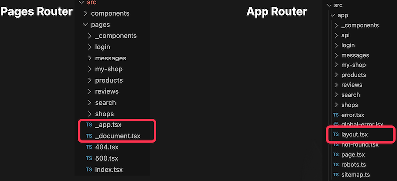
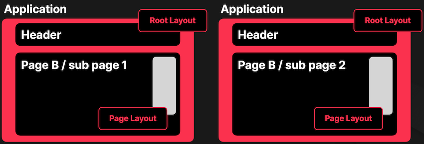
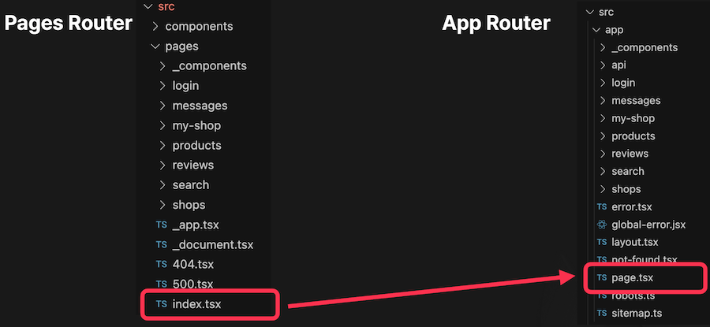
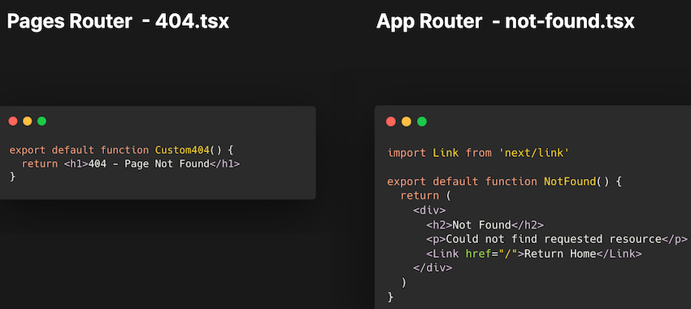
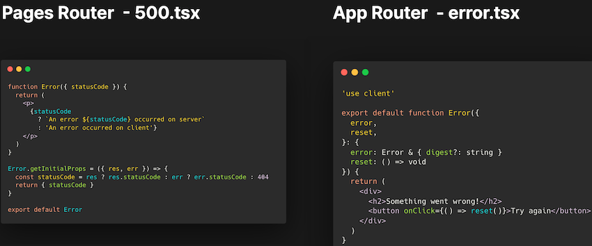
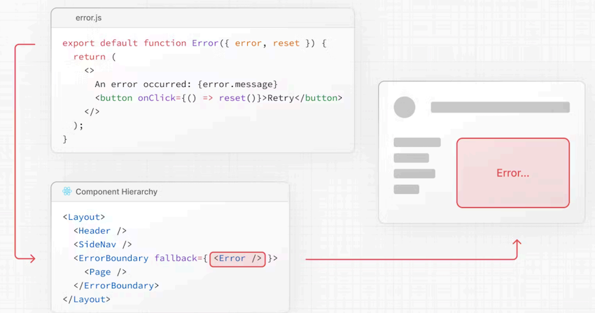
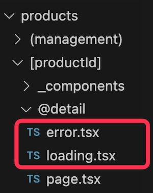
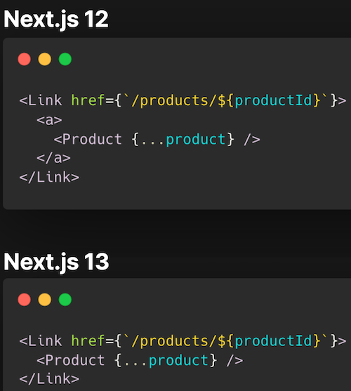
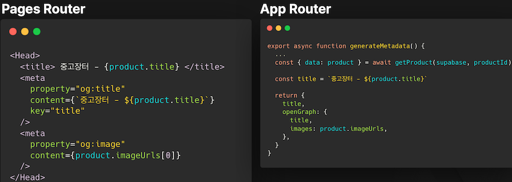

# App Router로 마이그레이션

## 1. 준비

### 1.1 Page & Layout



- `Page` : App Router에서 각각의 경로에 “고유한” UI를 구성하는 요소
- `Layout` : App Router에서 여러 경로간 “공유되는” UI를 구성하는 요소



Root Layout을 비롯해 여러 하위 Page Layout을 중첩시킬 수 있다.

---

### 1.2 SSR 데이터 불러오기



#### 1.2.1 Page Router

```tsx
import Banner from './_components/Banner'

export const getServerSideProps: GetServerSideProps = async (context) => {
  const supabase = getServerSupabase(context)
  const { data } = await getProducts()

  return { props: { products: data } }
}

export default function Home({ products }: InterGetServerSidePropsType<typeof getServerSideProps>) {
  return (
    <Wrapper>
      <Container>
        <Banner />
        <ProductList initialProducts={products} />
      </Container>
    </Wrapper>
  )
}
```

---

#### 1.2.2 App Router

Server Component를 통해 컴포넌트에서 직접 불러오기

```tsx
export default async function Home() {
  const cookieStore = cookies()

  const supabase = getServerComponentSupabase(cookieStore)

  const { data: products } = await getProducts(supabase, {
    fromPage: 0,
    toPage: 2,
  })

  return (
    <Wrapper>
      <Container>
        <Banner />
        <ProductList initialProducts={products} />
      </Container>
    </Wrapper>
  )
}
```

---

### 1.3 Server Component

- 서버에서 동작하는 React Component
- 서버 컴포넌트는 서버에서만 실행되며 번들 크기에 전혀 영향을 미치지 않습니다. 코드가 클라이언트에 다운로드되지 않으므로 번들 크기를 줄이고 시작 시간을 개선하는 데 도움이 됩니다.
- 서버 컴포넌트는 데이터베이스, 파일 시스템 또는 (마이크로)서비스와 같은 서버 측 데이터 소스에 액세스할 수 있습니다.
- 서버 컴포넌트는 점진적으로 렌더링되며 렌더링된 UI 단위를 클라이언트에 점진적으로 스트리밍합니다. 이를 서스펜스와 결합하면 개발자가 의도적인 로딩 상태를 만들고 페이지의 나머지 부분이 로드될 때까지 기다리는 동안 중요한 콘텐츠를 빠르게 표시할 수 있습니다.
- cf. https://github.com/reactjs/rfcs/blob/main/text/0188-server-components.md#summary

```tsx
import { readFile } from 'fs/promises'

export default async function App() {
  const data = await readFile('./local-data.txt')

  return (
    <div>
      <h1>File Content</h1>
      <div>{data}</div>
    </div>
  )
}
```

- `서버 컴포넌트`: 일반적으로 서버 컴포넌트는 서버에서 요청당 한 번만 실행되므로 상태가 없으며 클라이언트에만 존재하는 기능을 사용할 수 없습니다. 특히 서버 컴포넌트:
  - ❌ state는 서버에서 요청당 (개념적으로) 한 번만 실행되므로, 사용할 수 없습니다. 따라서 `useState()` 및 `useReducer()`는 지원되지 않습니다.
  - ❌ 렌더링 수명 주기(효과)를 사용할 수 없습니다. 따라서 `useEffect()` 및 `useLayoutEffect()`가 지원되지 않습니다.
  - ❌ DOM과 같은 브라우저 전용 API를 사용할 수 없습니다(서버에서 폴리필링하지 않는 한).
  - ❌ 상태 또는 효과에 의존하는 사용자 정의 훅 또는 브라우저 전용 API에 의존하는 유틸리티 함수를 사용할 수 없습니다.
  - ✅ 데이터베이스, 내부 (마이크로)서비스, 파일 시스템 등과 같은 서버 전용 데이터 소스에 `async / await` 기능을 사용할 수 있습니다.
  - ✅ 다른 서버 컴포넌트, 네이티브 요소(div, 스팬 등) 또는 클라이언트 컴포넌트를 렌더링할 수 있습니다.
  - `서버 훅/유틸리티`: 개발자는 서버용으로 설계된 사용자 정의 후크 또는 유틸리티 라이브러리를 만들 수도 있습니다. 서버 컴포넌트에 대한 모든 규칙이 적용됩니다. 예를 들어, 서버 훅의 한 가지 사용 사례는 서버 측 데이터 소스에 액세스하기 위한 헬퍼를 제공하는 것입니다.
- cf. https://github.com/reactjs/rfcs/blob/main/text/0188-server-components.md#capabilities--constraints-of-server-and-client-components

---

#### 1.3.1 Client Component

```tsx
'use client'

import { useEffect, useState } from 'react'

export default function App() {
  const [data, setData] = useState()

  useEffect(() => {
    requestContents('remote-data').then(setData)
  }, [])

  if (!data) {
    return null
  }

  return (
    <div>
      <h1>File Contents</h1>
      <div>{data}</div>
    </div>
  )
}
```

---

### 1.4 에러 처리

#### 1.4.1 404, 500 페이지

- `Page Router` : 400.tsx, 500.tsx
- `App Router` : not-found.tsx(400), error.tsx(500)



`not-found.tsx`는 클라이언트 컴포넌트에서만 동작



`error.tsx`는 클라이언트 컴포넌트에서만 동작

---

### 1.5 Error handling



- 서버 컴포넌트는 점진적으로 렌더링되며 렌더링된 UI 단위를 클라이언트에 점진적으로 스트리밍합니다. 이를 서스펜스와 결합하면 개발자가 의도적인 로딩 상태를 만들고 페이지의 나머지 부분이 로드될 때까지 기다리는 동안 중요한 콘텐츠를 빠르게 표시할 수 있습니다.
- Server Components are **rendered progressively and incrementally stream rendered units of the UI to the client**. Combined with Suspense, this allows developers to **craft intentional loading states** and **quickly show important content** while waiting for the remainder of a page to load.
- cf. https://github.com/reactjs/rfcs/blob/main/text/0188-server-components.md#summary



- `loading.tsx` : 해당 폴더의 컴포넌트가 로딩 중에 보여주는 컴포넌트
- `error.tsx` : 해당 폴더의 컴포넌트가 에러 시에 보여주는 컴포넌트

---

### 1.6 Link Component



13 버전부터 Link 컴포넌트 자식에 a태그를 넣지 않아도 된다.

---

### 1.7 Meta Data



---

## 2. 메인페이지

```tsx
import { Metadata } from 'next'

// either Static metadata
export const metadata: Metadata = {
  title: '...',
}

// or Dynamic metadata
export async function generateMetadata({ params }) {
  return {
    title: '...',
  }
}
```

- cf. https://nextjs.org/docs/app/api-reference/functions/generate-metadata

---

### 2.1 page 라우터 vs app 라우터 차이

```tsx
// (1) Page Router
import { useRouter } from 'next/router'

// (2) App Router
import { redirect } from 'next/navigation'
import { useRouter } from 'next/navigation'

const router = useRouter()
```

- nextjs 12 page router ==> `next/router` 사용
- nextjs 13 app router ==> `next/navigation` 사용
- cf. https://nextjs.org/docs/messages/next-router-not-mounted

---

## 3. 검색 페이지

### 3.1 Page 라우터의 Search Params

```tsx
export default function Page({
  params,
  searchParams,
}: {
  params: { slug: string }
  searchParams: { [key: string]: string | string[] | undefined }
}) {
  return <h1>My Page</h1>
}
```

- cf. https://nextjs.org/docs/app/api-reference/file-conventions/page

---

### 3.2 App 라우터의 useSearchParams

```tsx
'use client'

import { useSearchParams } from 'next/navigation'

export default function SearchBar() {
  const searchParams = useSearchParams()

  const search = searchParams.get('search')

  // URL -> `/dashboard?search=my-project`
  // `search` -> 'my-project'
  return <>Search: {search}</>
}
```

- app Router의 Client Component에서 Search Param 값을 참조하기 위해 사용할 수 있는 Hook
- cf. https://nextjs.org/docs/app/api-reference/functions/use-search-params

---

## 4. 상점 페이지

### 4.1 usePathname

```tsx
'use client'

import { usePathname } from 'next/navigation'

export default function ExampleClientComponent() {
  const pathname = usePathname()
  return <p>Current pathname: {pathname}</p>
}
```

- App Router의 Client Component에서 사용할 수 있는 Hook
- 현재 URL의 Pathname 확인 가능
- 페이지 최초 렌더링시에는 서버에서 HTML에 포함되어 전달
- 이후 페이지 이동시에는 서버와 관계 없이 Browser 데이터 사용
- cf. https://nextjs.org/docs/app/api-reference/functions/use-pathname

---

### 4.2 redirect

```tsx
import { redirect } from 'next/navigation'

async function fetchTeam(id) {
  const res = await fetch('https://...')
  if (!res.ok) return undefined
  return res.json()
}

export default async function Profile({ params }) {
  const team = await fetchTeam(params.id)
  if (!team) {
    redirect('/login')
  }

  // ...
}
```

- cf. https://nextjs.org/docs/app/api-reference/functions/redirect
