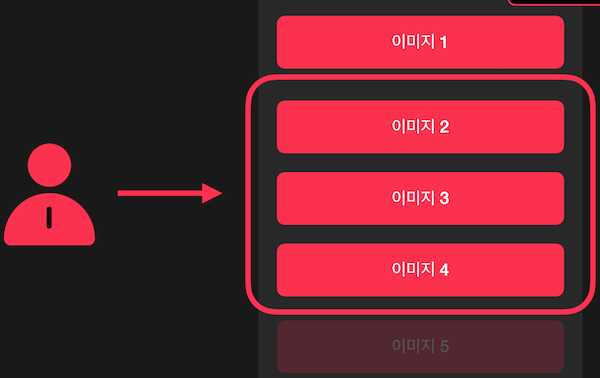
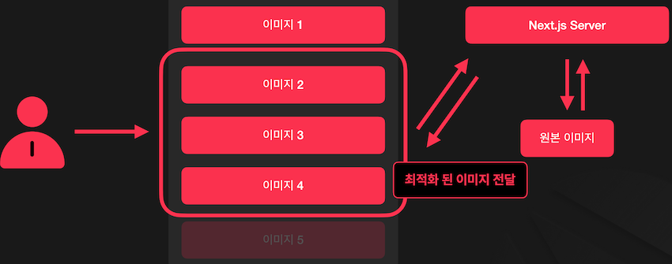
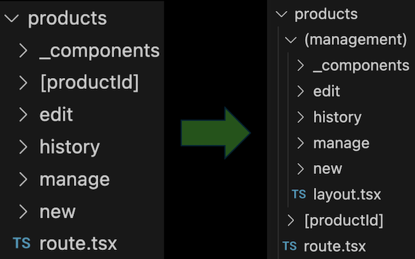
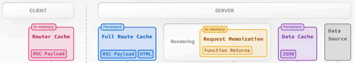

# 최적화 및 App Router 심화

## 1. Image 컴포넌트를 이용한 이미지 최적화

### 1.1 Lazy Loading



* 리소스를 필요한 경우에만 불러오는 전략
* ‘필요한 경우에만’ 리소스를 불러오므로 초기 로딩 속도 개선에 도움

------

### 1.2 next/image



* HTML Image Element를 확장하여 자동으로 이미지 최적화를 사용할 수 있게끔 도와주는 컴포넌트
* 4가지 주요 기능
  1. `이미지 크기 최적화` : 화면 크기에 맞게 이미지 크기 조정 
     * WebP, AVIF 같은 최신 이미지 포멧을 사용하여 이미지 크기 감소
  2. `UI 안정성 유지` : Layout Shift 방지를 통한 UI 안정성 유지
  3. `페이지 로딩 속도 감소` : Lazy Loading을 통해 사용자가 느끼는 페이지 로딩 속도 향상
  4. `유연하게 사용 가능` : 애플리케이션 내부의 이미지와 외부 서버의 이미지 모두에 적용 가능

------

### 1.3 로컬 이미지와 next/image

```tsx
import Image from 'next/image'
import profilePic from './me.png'
 
export default function Page() {
  return (
    <Image
      src={profilePic}
      alt="Picture of the author"
      // width={500} automatically provided
      // height={500} automatically provided
      // blurDataURL="data:..." automatically provided
      // placeholder="blur" // Optional blur-up while loading
    />
  )
}
```

* cf. https://nextjs.org/docs/app/building-your-application/optimizing/images

------

### 1.4 next/image 주요 Props

`Required(필수)`

* `src` : 이미지 파일 경로
* `alt` : 이미지의 대체 텍스트
* `width` : 이미지 파일의 너비
* `height` : 이미지 파일의 높이

`Optional(옵션)`

* `fill` : 이미지를 부모 요소에 채울지 여부 (width / height를 모르는 경우 사용)
* `quality` : 변환된 이미지의 Quality
* `placeholder` : 이미지가 로딩중일때 화면에 보여줄 임시 이미지 (‘empty’ | ‘blur’ | ‘data:image/..’)
  * `empty`: 로딩중일때 아무것도 보여주지 않음
  * `blur`: 저화질 이미지를 임시로 표시
    * (단, 원격 이미지를 사용중일 경우에는 blurDataURL Props로 저화질 이미지 전달 필요)
  * `data:image/..` : Props로 전달된 Data URI을 화면에 표시

------

### 1.5 원격 이미지와 next/image

```tsx
import Image from 'next/image'
 
export default function Page() {
  return (
    <Image
      src="https://s3.amazonaws.com/my-bucket/profile.png"
      alt="Picture of the author"
      width={500}
      height={500}
    />
  )
}
```

```tsx
module.exports = {
  images: {
    remotePatterns: [
      {
        protocol: 'https',
        hostname: 's3.amazonaws.com',
        port: '',
        pathname: '/my-bucket/**',
      },
    ],
  },
}
```

* cf. https://nextjs.org/docs/app/building-your-application/optimizing/images#remote-images

------

## 2. next/font를 이용한 폰트 최적화

웹 폰트를 사용할때 발생하는 아래 문제 해결 가능

1. Privacy
2. Layout Shift

------

### 2.1 Layout Shift

* `Layout Shift` : 사용자가 웹 페이지를 사용하는 도중 Layout이 변경되는 현상
* `Layout Shift (Fonts)` : 지정된 ‘font-size’가 같더라도 폰트 자체의 크기가 달라서 Layout Shift가 발생할 수 있음
* `CSS ‘size-adjust’ attribute` : 서로 다른 폰트 크기를 보정하기 위한 CSS Attribute

```css
@font-face {
  font-family: font-name-a;
  size-adjust: 90%;
}

@font-face {
  font-family: font-name-b;
  size-adjust: 110%;
}
```

------

### 2.2 next/font

```tsx
import { Inter } from 'next/font/google'
 
// If loading a variable font, you don't need to specify the font weight
const inter = Inter({
  subsets: ['latin'],
  display: 'swap',
})
 
export default function RootLayout({
  children,
}: {
  children: React.ReactNode
}) {
  return (
    <html lang="en" className={inter.className}>
      <body>{children}</body>
    </html>
  )
}
```

* `next/font/google` : Google Fonts에서 제공하는 폰트를 사용하기 위한 패키지
* cf. https://nextjs.org/docs/app/building-your-application/optimizing/fonts#google-fonts

```tsx
import localFont from 'next/font/local'
 
// Font files can be colocated inside of `app`
const myFont = localFont({
  src: './my-font.woff2',
  display: 'swap',
})
 
export default function RootLayout({
  children,
}: {
  children: React.ReactNode
}) {
  return (
    <html lang="en" className={myFont.className}>
      <body>{children}</body>
    </html>
  )
}
```

* `next/font/local` : Local에 존재하는 폰트 파일을 사용하기 위한 패키지
* cf. https://nextjs.org/docs/app/building-your-application/optimizing/fonts#local-fonts

------

### 2.3 next/font 주요 options

* `src` : 폰트 파일의 경로 (local에서만 필요)
* `weight` : 사용할 폰트의 weight (Google Variable Fonts 계열일 경우 불필요)
* `display` : CSS font-display 속성
* `fallback` : 웹폰트 불러오기를 실패했을떄 사용할 폰트
* `variable` : CSS Variable을 사용해 폰트를 설정할 경우 사용
* `adjustFontFallback` : Layout Shift 방지를 위해 사용할 대체 글꼴과 관련된 값
  * `next/font/google`일 경우 Boolean을 통해 사용 여부만 전달
  * `next/font/local`일 경우 string을 통해 기준이 될 대체 글꼴 전달

------

## 3. Route Groups



* URL Path와 매핑되지 않는 논리적인 그룹 폴더 이름을 괄호로 감싸주어서 사용

------

## 4. Parallel Routes

* 페이지 내부의 여러 요소를 병렬적으로 (또는 선택적으로) 불러와 렌더링 하는 기능
* cf. https://nextjs.org/docs/app/building-your-application/routing/parallel-routes


------

## 5. 상품 수정 / 등록 페이지에 Server Action 적용

### 5.1 Server Action

```tsx
export default function Page() {
  async function createInvoice(formData: FormData) {
    'use server'
 
    const rawFormData = {
      customerId: formData.get('customerId'),
      amount: formData.get('amount'),
      status: formData.get('status'),
    }
 
    // mutate data
    // revalidate cache
  }
 
  return <form action={createInvoice}>...</form>
}
```

* Form을 이용한 Data 변경을 API 생성 없이 Server에서 처리할 수 있는 기법
* cf. https://nextjs.org/docs/app/building-your-application/data-fetching/server-actions-and-mutations#forms

------

### 5.2 useFormState

* cf. https://react.dev/reference/react-dom/hooks/useFormState

------

## 6. 상품 API에 fetch cache 적용


* cf. https://nextjs.org/docs/app/building-your-application/caching#overview

------

### 6.1 Router Cache



* ‘각 경로’의 React Server Component Payload를 캐시하는 레이어 Browser Memory에 보관되며 새로고침하면 초기화

------

### 6.2 React Server Component Payload  (RSC Payload) 

React에서 Server Component를 렌더링한 결과물

1. ’Server Component’의 렌더링 결과
2. ’Client Component’를 렌더링 해야 하는 위치와 렌더링에 필요한 Javascript 파일 정보
3. Server Component에서 Client Component로 넘겨야 하는 Props 정보

------

### 6.3 Router Cache

#### 6.3.1 Router Cache 유지 시간


* `정적 페이지의 경우`: 5분간 캐시 유지
* `동적 페이지의 경우`: 30초간 캐시 유지 

[동적 페이지]

1. Server Component 내부에서 cookies, headers, searchParams를 사용하는 경우
2. Server Component 내부의 fetch 함수에서 ‘no-store’를 사용하거나, POST Method를 사용하는 등 캐시가 되면 안되는 형태인 경우 
   - 단, Link의 prefetch Props나 router.prefetch를 사용해서 미리 불러오는 경우 정적 페이지로 취급

------

#### 6.3.2 Router Cache Invalidation

1. Server Action을 통해
   - `revalidatePath` / `revalidateTag` 함수 사용
   - `cookies.set` / `cookies.delete` 함수 사용
2. `router.refresh` 실행

------

### 6.4 Full Route Cache


* Next.js 서버에서 렌더링된 모든 결과물을 캐싱하는 레이어


* cf. https://nextjs.org/docs/app/building-your-application/caching#2-nextjs-caching-on-the-server-full-route-cache

------

### 6.5 Request Memoization


* Next.js의 React Component Tree 하위에서 호출되는 Fetch 요청을 Memoization 하는 레이어


* cf. https://nextjs.org/docs/app/building-your-application/caching#request-memoization


* Fetch 함수를 사용할 때만 적용됨
* GET 요청에 대해서만 적용됨
* React Component Tree 하위에 있는 요청에 대해서만 적용됨

------

### 6.6 Data Cache


* 데이터를 캐시하는 레이어


* Cf. https://nextjs.org/docs/app/building-your-application/caching#data-cache

------

### 6.7 Route Handler


* 사용자 요청을 Web Request와 Response API를 사용하여 처리할 수 있게끔 해주는 기능
* cf. https://nextjs.org/docs/app/building-your-application/routing/route-handlers

```tsx
import { cookies } from 'next/headers'
 
export async function GET(request: Request) {
  const cookieStore = cookies()
  const token = cookieStore.get('token')
 
  return new Response('Hello, Next.js!', {
    status: 200,
    headers: { 'Set-Cookie': `token=${token.value}` },
  })
}
```

* cf. https://nextjs.org/docs/app/building-your-application/routing/route-handlers#dynamic-functions

------

## 7. sitemap.xml / robots.txt 추가

### 7.1 sitemap.xml

```xml
<urlset xmlns="http://www.sitemaps.org/schemas/sitemap/0.9">
  <url>
    <loc>https://acme.com</loc>
    <lastmod>2023-04-06T15:02:24.021Z</lastmod>
    <changefreq>yearly</changefreq>
    <priority>1</priority>
  </url>
</urlset>
```

* `sitemap.xml` : 애플리케이션에서 제공하는 웹 페이지의 주소를 나열한 파일
* cf. https://nextjs.org/docs/app/api-reference/file-conventions/metadata/sitemap

```tsx
import { MetadataRoute } from 'next'
 
export default function sitemap(): MetadataRoute.Sitemap {
  return [
    {
      url: 'https://acme.com',
      lastModified: new Date(),
      changeFrequency: 'yearly',
      priority: 1,
    },
    {
      url: 'https://acme.com/about',
      lastModified: new Date(),
      changeFrequency: 'monthly',
      priority: 0.8,
    },
    {
      url: 'https://acme.com/blog',
      lastModified: new Date(),
      changeFrequency: 'weekly',
      priority: 0.5,
    },
  ]
}
```

------

### 7.2 robots.txt

```txt
User-Agent: *
Allow: /
Disallow: /private/

Sitemap: https://acme.com/sitemap.xml
```

* `robots.txt` : 애플리케이션에서 검색엔진 크롤러가 어떻게 동작해야 하는지를 정리한 파일
* cf. https://nextjs.org/docs/app/api-reference/file-conventions/metadata/robots

```tsx
import { MetadataRoute } from 'next'
 
export default function robots(): MetadataRoute.Robots {
  return {
    rules: {
      userAgent: '*',
      allow: '/',
      disallow: '/private/',
    },
    sitemap: 'https://acme.com/sitemap.xml',
  }
}
```

------

## 8. Sentry

* 애플리케이션에서 발생한 에러를 추적하는데 사용되는 서비스
* 에러가 발생하면, `이메일/ Slack` 등으로 메일을 보내줌
