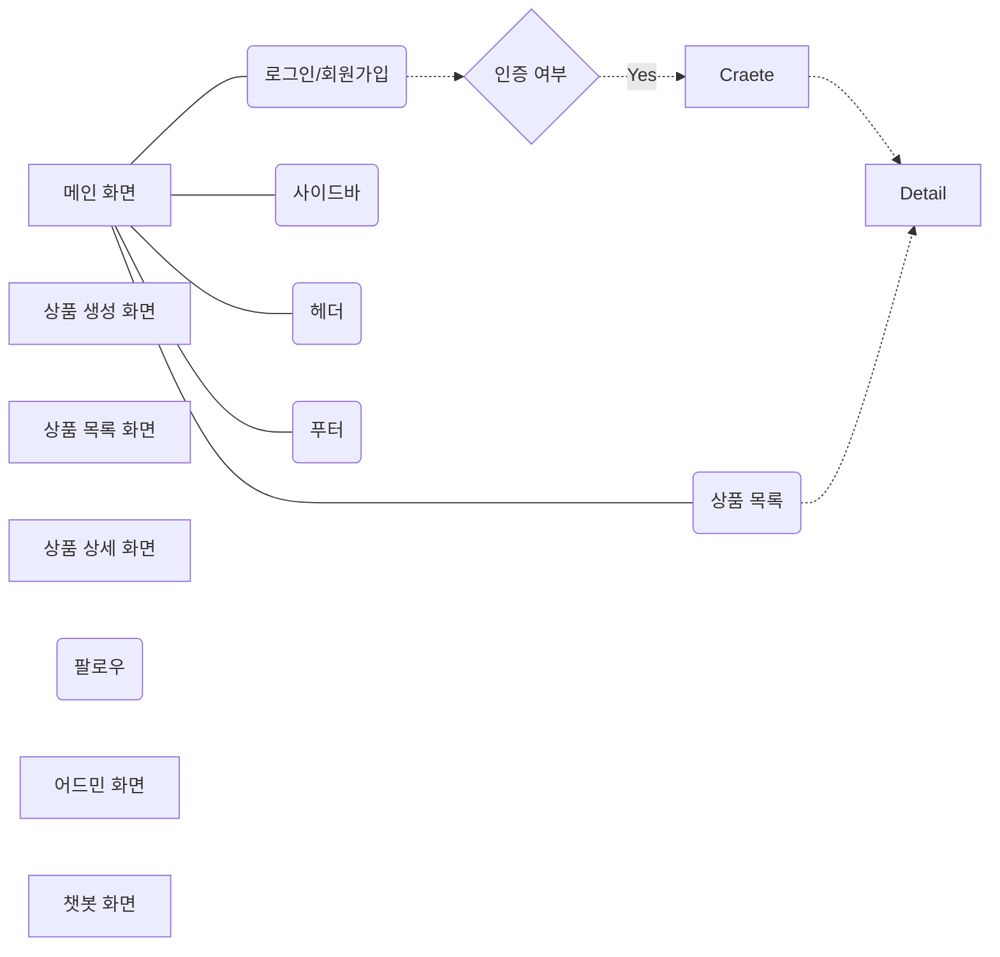

# 중고장터 프로젝트 플로우 차트

```mermaid
graph LR
	Home[메인 화면]
	UserInfo(로그인/회원가입)
	Aside(사이드바)
	Header(헤더)
	List(상품 목록)
	Footer(푸터)

	Home --- Header
	Home --- UserInfo
	Home --- Aside
	Home --- List
	Home --- Footer

	ProductCraete[상품 생성 화면]
	ProductList[상품 목록 화면]
	ProductDetail[상품 상세 화면]

	Follow(팔로우)


	Admin[어드민 화면]
	Chat[챗봇 화면]

	Authorize{인증 여부}

	UserInfo -.->  Authorize -.->|Yes|Craete -.-> Detail


	List -.-> Detail
```

- `[]` 는 화면을 표시, 구성 요소는 `()`로 표시
- 화면 간 구성요소는 `실선`, 페이지 간 이동은 `점선`으로 표시
- `{}`는 분기 표시
